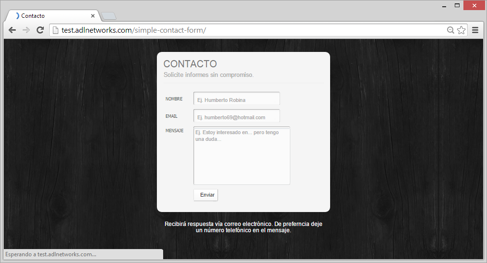
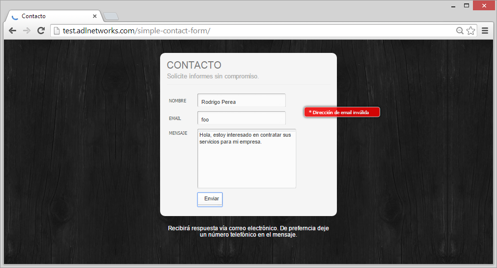
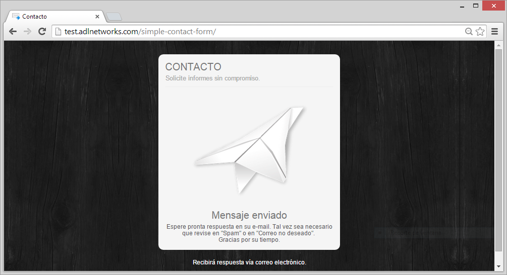

# Simple Contact Form

A simple AJAX powered contact form with PHP.

See it [Live.](http://www.adlnetworks.com/_src/form/simplecontactform)

## Preview

Here some app screenshots:


Image 1. Blank form.


Image 2. Validation engine alert.


Image 3. Sending message proccess.


Image 4. Succesfull message sent advice.


Image 5. Preview message at email inbox.

You can find these preview screnshots in folder `preview/`.


# Setup

Configs in the code

**Setup Environment:**
E-mail adress and website host configuration.
```
/public/app/config.php 						Ln: 37, 38
```

**Debug configuration:**
```
/public/app/msj-view.php 					Ln: 77 
```

## The content

You'll find the following directories, logically grouping common assets. You'll see something like this:

``` 

├───preview
├───public			=> MAIN APP DIRECTORY
│   ├───app			=> Server side scripts
│   ├───assets		=> Front-End assets
│   │   ├───img
│   │   ├───lib
│   │   │   └───jquery
│   │   └───plugins
│   │       ├───formValidator
│   │       └───jqtransformplugin
│   │           └───img
│   │               ├───input
│   │               └───textarea
│   │                   └───notneeded
│   └───libs			=> Back-end libreries
│       └───phpmailer
└───stock
```
Sometimes is compiled and minified CSS and JS (`file.min.*`).

## Author

**Adalberto Vargas**

- <http://www.adalbertovargas.com/>

### Hire me

I'm available for freelance work. Remote worldwide or locally around Guadalajara, Puebla, Mexico & Monterrey. Mail me: contacto@adalbertovargas.com

#### Just For ADL

Location

Local development:
```
:/xampp/htdocs/1/LABS/simpleContactForm
```
Local run:
```
http://localhost/1/LABS/simpleContactForm/public/index.php
```
GitHub:
```
https://github.com/adalbertovargas/simpleContactForm
```
## Copyright and license

Copyright 2014 [ADL NETWORKS](https://www.adlnetworks.com), S.A.

Code Licensed under [MIT](http://www.opensource.org/licenses/mit-license.php). Totally free for private or commercial projects.
